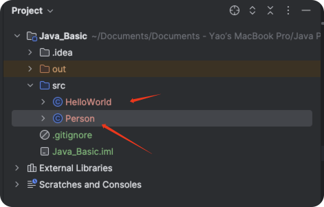

# Java Packages


## Your First Java Program


```java
public class HelloWorld {
    public static void main(String[] args) {
        System.out.println("Hello, World!");
    }
}
// Hello, World!
```

In Java, the class is a fundamental concept. As an object-oriented programming language, Java structures nearly all code around objects and classes, requiring at least one class for a program to run.


### Referencing our Person in HelloWorld

```java
public class HelloWorld {
    public static void main(String[] args) {
        System.out.println("Hello, World!");

        Person person = new Person("Borui Education", 4);
        person.introduce();
    }

}

//Hello, World!
//Hello, my name is Borui Education and I am 4 years old.
```


### File System




## Why Packages Are Essential in Java


##### The concept of a package in Java was introduced to address several key issues:

#### 1. Organization

As projects grow, a single folder can end up containing hundreds of Java files, making the codebase hard to manage. Packages allow developers to group related classes and interfaces together, facilitating better organization and usability. For instance, classes handling database connections can be grouped in a database package, while those managing user interfaces might be in a ui package.


#### 2. Naming Conflicts

Large projects or merges often result in naming conflicts between classes. Packages provide a namespace mechanism that allows classes with the same name to coexist as long as they are in different packages. For example, you could have two Date classes, one in com.myproject.util and another in java.util, without any conflict.


#### 3. Access Control

Packages in Java offer a way to control the access level of classes and their members. Java supports four levels of access: private, default (no explicit modifier), protected, and public. These modifiers determine where class members (fields, methods, constructors, etc.) can be accessed, aiding in encapsulation by hiding implementation details and protecting data.


#### 4. Reusability and Maintainability

By grouping similarly functional classes and interfaces together, packages promote code reuse. Other projects can easily import and use these packages without worrying about naming conflicts or dependencies. This also makes maintenance and updates easier, as related code is centralized.


#### 5. Ease of Distribution

The package structure also facilitates the easier packaging and distribution of Java applications. For instance, Java’s JAR file format is based on the package structure, allowing developers to bundle related files (class files, resource files, etc.) into a single archive. This simplifies the deployment and distribution process.


#### Summary

In summary, the concept of packages in Java is a crucial component of object-oriented programming, enhancing code manageability, flexibility, and scalability by providing organization, solving naming conflicts, controlling access levels, promoting reusability and maintainability, and simplifying distribution processes.


