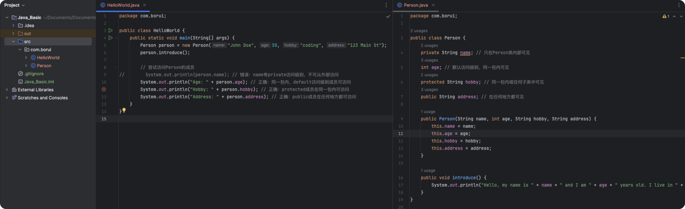
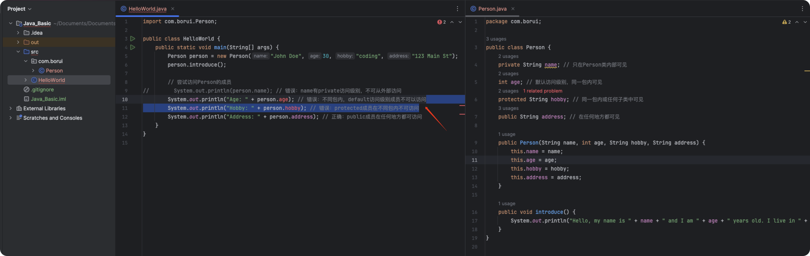

# Class in Java


#### In Java, the class is a core concept. Being an object-oriented programming language, Java structures nearly all code around the concept of objects and classes. Almost every Java program must include at least one class to function.


## Why Do We Need Classes?

1. **Encapsulation**：Classes provide a mechanism to encapsulate data (attributes) and the methods (functions or procedures) that operate on the data into a single unit. This helps isolate different parts of a program, making each part easier to understand and maintain.
2. **Reusability**：With classes, you can create objects, each possessing the attributes and methods defined by the class. This allows for the reuse of a class to create multiple objects, each sharing the same characteristics and behaviors but maintaining their own data states.
3. **Inheritance**：Classes enable the use of inheritance, where one class can inherit the attributes and methods of another. This promotes code reuse and extensibility.
4. **Polymorphism**：Polymorphism allows for multiple forms of implementation for an interface. Classes and inheritance enable method calls to be determined at runtime, increasing program flexibility and scalability.

### Basic Structure of a Class

##### A class in Java can typically contain the following:

- **Fields (Attributes)**: Also known as member variables, these are variables defined within the class to store the state data of objects.
- **Methods**: Also known as member functions, these are functions defined within the class to implement the behaviors of objects.
- **Constructors**: A special type of method used to initialize the state of an object when it is created.
- **Blocks**: Used for initializing code blocks.
- **Nested Classes and Interfaces**: Other classes or interfaces can be defined within a class.


  

### Example: Defining a Simple Class


```
javaCopy code
public class Person {
    // Attributes (member variables)
    String name;
    int age;
    
    // Constructor
    public Person(String name, int age) {
        this.name = name;
        this.age = age;
    }
    
    // Method
    public void introduce() {
        System.out.println("Hello, my name is " + name + " and I am " + age + " years old.");
    }
}
```

In this example, the Person class has two attributes, name and age, a constructor to initialize these attributes, and an introduce method to print a personal introduction.


### Conclusion

Classes are foundational to Java programming, serving as the primary means for organizing and implementing code logic. By defining and using classes, you can build complex applications while maintaining code readability, maintainability, and scalability. Understanding and mastering the concept of classes is a key step toward becoming an effective Java programmer.


### Referencing Our Person in HelloWorld


```java
public class HelloWorld {
    public static void main(String[] args) {
        System.out.println("Hello, World!");

        Person person = new Person("Borui Education", 4);
        person.introduce();
    }

}

//Hello, World!
//Hello, my name is Borui Education and I am 4 years old.
```


### Specific Explanation of Classes

* 1 `private`

  - **Scope**：Visible only within the same class.
  - **Purpose**：Used to hide class implementation details and protect class data from direct external access.


* 2 `default` (no access modifier)

  - **Scope**： Visible only within classes in the same package.

  - **Purpose**：Allows class members to be accessed within the same package without being exposed to the outside.


* 3 `protected`

  - **Scope**：Visible in the same package and all subclasses.

  - **Purpose**：Allows subclasses to access and override protected members of the parent class, promoting class inheritance and polymorphism.


* 4 `public`

  - **Scope**：Visible to all classes.

  - **Purpose**：Used to define parts of the API that are public, allowing any external class to access them.


#### Comparison of Access Levels


##### The following table provides a quick reference for the accessibility of different access modifiers:

| Access Level	    | Inside Class	 | Same Package	 | Subclasses | Worldwide |
| ----------- | :----: | :------: | :--: | :--: |
| `private`   |   ✓    |          |      |      |
| `default`   |   ✓    |    ✓     |      |      |
| `protected` |   ✓    |    ✓     |  ✓   |      |
| `public`    |   ✓    |    ✓     |  ✓   |  ✓   |

#### Examples:

##### When HelloWorld and Person are in the same package, only private is not accessible.




##### 而当我们把Helloworld移动到包外部：



#### Why is Encapsulation Important?

##### Encapsulation is one of the core features of object-oriented programming and helps to:

- **Protect and Hide Data**: Ensures that a class's internal state cannot be accessed and modified indiscriminately by external code.
- **Reduce Coupling**：By restricting access levels, dependencies between classes can be minimized, enhancing code maintainability and scalability.
- **Enhance Interface Clarity**: Encapsulation allows class users to see only the public parts without concerning themselves with implementation details, making the code easier to understand and use.

### Method Functions

#### 6. Static Variable

In Java, the static keyword is used to manage variables and methods in memory. When a variable is declared static, it becomes associated with the class rather than any specific instance of the class. This means that a single copy of a static variable is shared among all instances of the class, regardless of how many instances are created.

Let’s explain in detail:


### Static Methods (Class Methods)

- **Independent of Instances**: Static methods can be called without creating an instance of the class. For example, Math.sqrt() is a static method that can be called using the class name without needing to create an object of the Math class.
- **Limitations**:Static methods cannot access the class’s instance variables or instance methods because they can be called without any object of the class.


### Example

Consider the following class, which has a static variable numOfStudents that tracks how many Student instances have been created:


```java
javaCopy code
public class Student {
    public static int numOfStudents = 0;

    public Student() {
        numberOfObjects++;
    }
}
```

```java
Student stu1 = new Student(); // numOfStudents现在是1
Student stu2 = new Student(); // numOfStudents现在是2
```

#### Example 2

```java
public class DoOperations {
    // Returns the square of an integer
    public int product(int n) {
        return n * n;
    }

    // Returns the square of a double
    public double product(double x) {
        return x * x;
    }

    // Returns the product of two integers
    public double product(int x, int y) {
        return x * y;
    }
}

```

```java
DoOperations operations = new DoOperations();

int squareOfFour = operations.product(4); // Calls the first method
double squareOfFivePointFive = operations.product(5.5); // Calls the second method
double productOfTwoAndThree = operations.product(2, 3); // Calls the third method
```


No matter how many instances of MyClass are created, there is only one memory copy of numberOfObjects, and all instances will see the same value.


### Summary

Using static variables allows sharing the same data among multiple objects, typically used for functions like counters or shared configurations. On the other hand, static methods are used for implementing functions that do not require object state, such as utility methods. Understanding the role of static in memory management is crucial for writing efficient and well-organized Java code.


