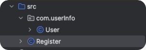

# AP Computer Science A


## 一个例子教会你面向对象编程

##### Java最重要的就是Class（类）的概念，这个Note花了大部分时间来解释有关Class（类）。在下面的文档之前，我们先来看一个例子。这个例子适合已经对Java编程有所了解的学生，会相对的复杂一些。


#### 包结构

在com.userInfo这个包（文件夹）下面，存放这User这个Class



Register这个Class在包的外面。


**User Class**

```java
package com.userInfo;// Define a User Class

import java.time.LocalDate;

public class User {

    // Part 1. Fields 属性定义
    // 定义了一个注册用户的三个基本属性，1.用户名，2.邮箱， 3.密码， 4.时间戳， 5.是否有效， 6.计数器，7. 固定短语
    private String username;
    private String email;
    private String password;
    private final LocalDate joinedAt =LocalDate.now(); // 自动得到当前注册日期，这个时间不允许被更改，因此设置为了final
    private LocalDate renewedAt; // 如果一年后用户renew，则添加renew的日期，默认为null，
    private boolean isActive = true; // 我们假定用户自注册开始有一年的有效期，默认为有效，如果一年后没有续费，则应该变化为false。一年后将使用renewedAt来进行条件的判断。
    public static int count; // 用来统计注册用户的总数量，任何一个新注册用户，都应该调用这个加一。


    // Part 2. Constructor 构造函数
    public User () {
        count++; // 任何无参数实例化都会让计数器加1
    }
    public User (String u, String e, String p, String p2){
        count++; // 任何参数实例化也会让计数器加1
        this.username = u;
        // 对于邮件，需要判断邮件格式是否正确
        if (emailValidation(e)) setEmail(e); else setEmail("邮箱格式不对");

        // 对于密码，俩个密码必须一直
        if (passwordValidation(p, p2)) setPassword(p);
        else setPassword("密码不一致");
    }

    public String toString(){
        return "Username: "+this.username +"\n"+"User Email: "+this.email +"\n" + "User Password: "+this.password+"\n" + "User Joined At: "+this.joinedAt + "\n"+ "User Active: " + this.isActive + "\n";
    }


    // Part 3. Getters, Accessors
    // 因为大部分的属性为Private，Private，顾名思义，只能在这个Class（类）中使用。因此这个class外需要使用属性时候，需要专门的accessors，也叫做getters
    public String getUsername(){
        return this.username;
    }
    public String getPassword(){
        return this.password;
    }
    public String getEmail(){
        return this.email;
    }
    public LocalDate getJoinedAt() {
        return joinedAt;
    }
    public LocalDate getRenewedAt() {
        return renewedAt;
    }
    public boolean isActive(){
        LocalDate today = LocalDate.now();
        return (this.renewedAt == null || this.renewedAt.isAfter(today)); //如果是默认值，则证明从来没有设置过，因此还是在注册一年之内，如果过期日在今天之后
    }


    // Part 4. Setters, Mutators
    // 同样道理，当我们需要更改属性时候，也必须要有对应的方式，我们叫做setters，或者Mutators
    public void setUsername(String username) {
        this.username = username;
    }
    public void setEmail(String email) {
        this.email = email;
    }
    public void setPassword(String password) {
        this.password = password;
    }
    public void setRenewedAt(LocalDate renewedAt) {
        this.renewedAt = renewedAt;
    }
    public void setActive(boolean isValid) {
        this.isActive = isValid;
    }


    // Part 4. Methods
    // 在这里，你可以定义各种的函数，方法来实现用户注册的过程。

    // 例子1 密码的确认。我们在前端传入的数据里面应该有两个密码，password，ConfirmedPassword，如果两个密码相同，才可以通过注册。
    public boolean passwordValidation(String password, String confirmedPassword){
        // void的用法，可以看到，没有返回任何的值，这个方法就是为了验证密码的一致性，因此不需要返回值

        if (password.equals(confirmedPassword)) { // 提问：为什么要用equals，可以用==么？
            return true; // 如果密码一致，调用setters，才给对象属性付值
        }
        return false;
    }

    // 例子2 邮箱Email的格式验证 for-loop, 我们这里做了简化，因为是为了APCSA而已，所以验证比较简单
    // 为了完成这个邮箱验证功能，我们可以使用一个 for 循环来遍历电子邮件字符串，并检查是否满足以下三个条件：
    // 邮箱地址的首字符是英文字母。
    // 邮箱地址中包含 '@' 字符。
    // '@' 字符后面至少存在一个 '.' 字符。
    public static boolean emailValidation(String email) {
        if (email == null || email.isEmpty()) {   // 提问： 这两个有什么区别？ ==null 难道跟 isEmpty() 不一样么？ 提示：isEmpty()是java自带的一个库，等同 email.length() == 0
            return false;  // 确保邮箱地址不为空
        }

        // 检查首字符是否为英文字母
        char firstChar = email.charAt(0);  //chartAt()， Java自带库，取第一个字符
        if (!(firstChar >= 'A' && firstChar <= 'Z') && !(firstChar >= 'a' && firstChar <= 'z')) {
            return false;
        }

        boolean foundAt = false;  // 是否找到 '@'
        boolean foundDotAfterAt = false;  // '@' 之后是否有 '.'

        // 遍历字符串检查 '@' 和 '.'， 这一段逻辑其实还是很巧妙的，花点时间看一下，这部分并不超纲。
        for (int i = 1; i < email.length(); i++) { // 提问：为什么i从1开始，不从0开始
            char ch = email.charAt(i);
            if (ch == '@') {
                if (foundAt) {
                    return false;  // 确保 '@' 只出现一次
                }
                foundAt = true;
            } else if (ch == '.' && foundAt) {
                foundDotAfterAt = true;
            }
        }

        return foundAt && foundDotAfterAt;
    }

}
```

**Register Class**

```java
import com.userInfo.User;

import static com.userInfo.User.count;

public class Register {
    public static void main(String[] args) {
        User user1 = new User();
        User user2 = new User("username", "user@user.com", "password", "passw1ord");
      	u

        System.out.println(user1.toString());
        System.out.println(user2.toString());

        System.out.println("Total Users ::: "+count);

    }
}
 
// 运行结果 可以copy到自己的IDE中运行一下，感受一下。 
/*
Username: null
User Email: null
User Password: null
User Joined At: 2024-04-15
User Active: true

Username: username
User Email: user@user.com
User Password: password
User Joined At: 2024-04-15
User Active: true

Username: username
User Email: 邮箱格式不对
User Password: 密码不一致
User Joined At: 2024-04-15
User Active: true

Total Users ::: 3
*/
```

#### 如果有疑问，可以添加我的微信：ngc_sony, 这个例子还在继续的不断更新完善中。
#### 这个document刚开始做一周，每周会进行一定的更新。
