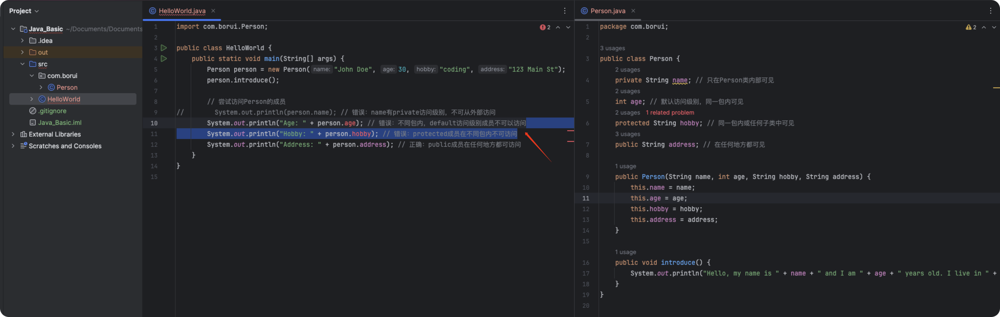

# 类 (Class)


#### 在Java中，类（class）是一个非常核心的概念。Java是一种面向对象的编程语言，这意味着几乎所有的代码结构都是围绕对象（object）和类的概念来构建的。在Java中，几乎每个程序都必须包含至少一个类才能运行。


## 为什么需要类？

1. **封装**：类提供了一种将数据（属性）和操作数据的方法（函数或过程）封装为一个整体的机制。这有助于将程序的不同部分隔离开来，使得每部分更容易理解和维护。
2. **重用**：通过类，您可以创建对象，每个对象都具有类定义的属性和方法。这意味着您可以重用一次编写的类来创建多个对象，每个对象都拥有相同的特性和行为，但保留自己的数据状态。
3. **继承**：类允许使用继承机制，其中一个类可以继承另一个类的属性和方法。这促进了代码的重用和扩展性。
4. **多态**：多态性允许一个接口使用多种形式的实现。类和继承机制使得可以在运行时确定调用哪个方法，这增加了程序的灵活性和可扩展性。


### 类的基本结构

##### Java中的类基本上可以包含以下部分：

- **属性（Fields）**：也称为成员变量，这些是类中定义的变量，用于存储对象的状态数据。

- **方法（Methods）**：也称为成员函数，这些是类中定义的函数，用于实现对象的行为。

- **构造函数（Constructors）**：这是一种特殊类型的方法，用于在创建对象时初始化对象的状态。

- **块（Blocks）**：用于初始化代码块。

- **嵌套类和接口（Nested classes and interfaces）**：类中可以定义其他类或接口。

  

### 示例：定义一个简单的类

```
javaCopy code
public class Person {
    // 属性（成员变量）
    String name;
    int age;
    
    // 构造函数
    public Person(String name, int age) {
        this.name = name;
        this.age = age;
    }
    
    // 方法
    public void introduce() {
        System.out.println("Hello, my name is " + name + " and I am " + age + " years old.");
    }
}
```

在这个例子中，`Person`类有两个属性`name`和`age`，一个构造函数来初始化这些属性，以及一个`introduce`方法来打印个人介绍。


### 结论

类是Java编程的基础，是组织和实现代码逻辑的主要手段。通过定义和使用类，您可以构建复杂的应用程序，同时保持代码的可读性、可维护性和可扩展性。理解并掌握类的概念是成为一名有效的Java程序员的关键步骤。


### 在HelloWorld中引用我们Person

```java
public class HelloWorld {
    public static void main(String[] args) {
        System.out.println("Hello, World!");

        Person person = new Person("Borui Education", 4);
        person.introduce();
    }

}

//Hello, World!
//Hello, my name is Borui Education and I am 4 years old.
```


### 文件系统


### 类的具体说明

* 1 `private`

  - **作用域**：仅在同一个类中可见。

  - **用途**：用于隐藏类的实现细节和保护类的数据，防止外部直接访问。


* 2 `default`（无访问修饰符）

  - **作用域**：仅在同一包内的类中可见。

  - **用途**：使类成员能在同一包内的其他类中访问，而不对包外公开。


* 3 `protected`

  - **作用域**：在同一包内以及所有子类中可见。

  - **用途**：允许子类访问和重写父类的保护成员，促进了类的继承和多态性。


* 4 `public`

  - **作用域**：对所有类可见。

  - **用途**：用于定义对外公开的API部分，使得任何外部类都可以访问。


#### 访问级别的比较

##### 以下表格提供了不同访问修饰符的可访问性快速参考：

| 访问级别    | 类内部 | 同一包内 | 子类 | 全局 |
| ----------- | :----: | :------: | :--: | :--: |
| `private`   |   ✓    |          |      |      |
| `default`   |   ✓    |    ✓     |      |      |
| `protected` |   ✓    |    ✓     |  ✓   |      |
| `public`    |   ✓    |    ✓     |  ✓   |  ✓   |

#### 例子：

##### 当Helloworld和Person都在同一个包内，只有private不可以访问


##### 而当我们把Helloworld移动到包外部：



#### 为什么封装很重要？

##### 封装是面向对象编程的核心特性之一，它有助于：

- **保护和隐藏数据**：确保类的内部状态不会被外部代码随意访问和修改。

- **减少耦合**：通过限制访问级别，可以最大程度地减少类之间的依赖，提高代码的可维护性和可扩展性。

- **增强接口清晰度**：封装使得类的使用者只能看到对外开放的部分，而不必关心实现细节，从而使代码更加易于理解和使用。

### 方法函数
#### 6. Static Variable

在Java中，`static` 关键字用于管理内存中的变量和方法。当你将一个变量声明为 `static`，它就变成了一个与类关联的变量，而不是与类的任何特定实例关联的。这意味着无论创建了多少个类的实例，`static` 变量的单一副本都将被所有实例共享。

让我们来详细解释一下：

### 静态变量（类变量）

- **共享值**：所有类实例共享同一个静态变量。如果一个实例修改了这个静态变量的值，那么所有其他实例看到的该变量的值也会是同样的修改后的值。
- **内存分配**：`static` 关键字确保内存中只分配一次空间给这个变量。这发生在类被加载到内存的时候，而不是每次创建类的实例时。

### 静态方法（类方法）

- **独立于实例**：静态方法可以在不创建类的实例的情况下调用。例如，`Math.sqrt()` 是一个静态方法，可以直接使用类名调用而无需创建 `Math` 类的对象。
- **限制**：静态方法不能访问类的实例变量和实例方法，因为它们在没有类的对象的情况下就可以被调用。

### 示例

考虑以下类，它有一个静态变量 `numOfStudents`，它将跟踪创建了多少个 `Student` 实例：

```java
javaCopy code
public class Student {
    public static int numOfStudents = 0;

    public Student() {
        numberOfObjects++;
    }
}
```

每次创建 `Student` 的新实例时，构造函数都会增加 `numOfStudents`。由于 `numOfStudents` 是静态的，所以与 `Student` 相关联，而不是与任何单独的实例相关联：

```java
Student stu1 = new Student(); // numOfStudents现在是1
Student stu2 = new Student(); // numOfStudents现在是2
```

#### 例2

```java
public class DoOperations {
    // Returns the square of an integer
    public int product(int n) {
        return n * n;
    }

    // Returns the square of a double
    public double product(double x) {
        return x * x;
    }

    // Returns the product of two integers
    public double product(int x, int y) {
        return x * y;
    }
}

```

```java
DoOperations operations = new DoOperations();

int squareOfFour = operations.product(4); // Calls the first method
double squareOfFivePointFive = operations.product(5.5); // Calls the second method
double productOfTwoAndThree = operations.product(2, 3); // Calls the third method
```


无论创建多少个 `MyClass` 的实例，`numberOfObjects` 都只有一份内存副本，并且所有实例都会看到同一个值。

### 总结

使用 `static` 变量可以在多个对象之间共享同一个数据，这通常用于实现像计数器或共享配置这样的功能。另一方面，静态方法则用于实现那些不需要对象状态的功能，比如工具方法。理解 `static` 在内存管理中的作用对于编写高效和组织良好的Java代码非常重要。


